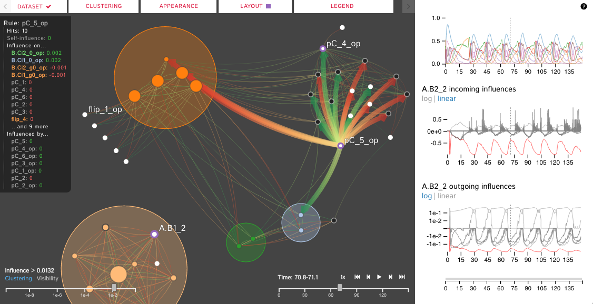
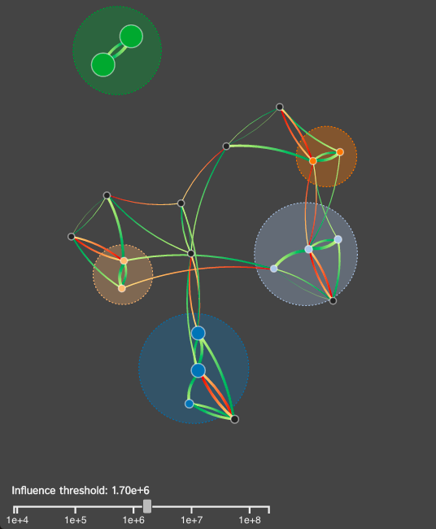
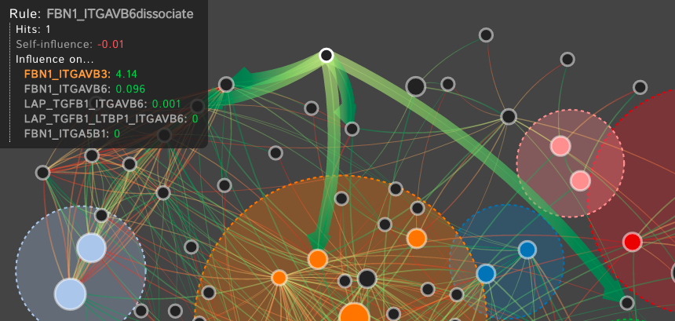
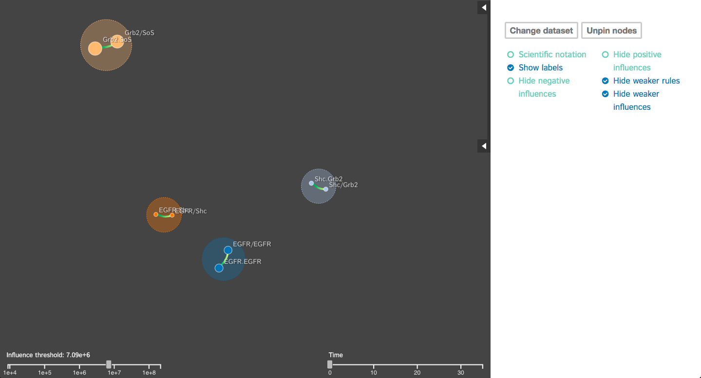
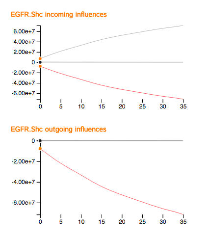

# Dynamic Influence Networks
Interactive visualization of Dynamic Influence Networks for rule-based models. 





DIN Project members: 

Angus Forbes, Andrew Burks, Kristine Lee, and Xing Li (University of Illinois at Chicago); Jean Krivine (Universite Paris Diderot); Pierre Boutillier and Walter Fontana (Harvard Medical School)

DIN-Viz Software Development: 

Andrew Burks, Kristine Lee, Xing Li (University of Illinois at Chicago)


# Installation Instructions

- Extract the Github repo's contents to a folder. 
- Navigate to the folder (should contain index.html) and use the command:
```[path to python.exe]\python -m SimpleHTTPServer 8080``` to start the server. If this command cannot start the server, use the command: ```[path to python.exe]\python -m http.server 8080``` instead. 
- Go to localhost:8080 on Google Chrome to load the visualization.

Alternatively, the page is hosted using GitHub Pages at https://creativecodinglab.github.io/DynamicInfluenceNetworks/. (Use the "Dataset" meny to load in data/miniKaiProb3.zip to explore a larger example dataset, or choose your own KaSim output - see below.)

# How to Use

To load data, please click on the "Dataset" menu on the toolbar to load in individual json files or zipped time series json files. Alternatively, you can drag the files into the application to load the data. 

_Please make sure that the times series json files are in the format name_\__\[0-x]\.json (i.e flux_1.json, flux_2.json etc)_

# Motivation 

For many systems, the specifics regarding the interactions and effects within complex biological systems are unknown. Kappa Simulator ([KaSim](http://www.kappalanguage.org)) stochastic simulator of rules defined using the Kappa language. It is used, in this case, for simulating protein interaction networks. A tool to represent the results of these simulations can help systems biologists to better understand the complex systems that they are modeling. This creates a feedback loop between the creation and the visualization of the simulations which iteratively improves both the system models as well as the visual analytics tools which aid in representing and analyzing the biological systems. The current tools do not scale well, are static, cluttered, and can not support time-series visualization. We define the Dynamic Influence Network (DIN) to represent the rules and the influence these rules have on other rules that model the system. Our software tool, DIN-Viz, facilitates the analysis of DINs created from KaSim simulation output.

# Summary

DIN-Viz utilizes a force-directed network overlaid on top of influence-based clustering information for the Kappa rules (these influences are generated using Kappa Simulator output data). Due to relatively small number of nodes in these protein-protein interaction simulations, along with our threshold clustering method, the threshold is interactively controllable, and the clustering can recompute in real-time. To reduce clutter, the user may choose to manually rearrange areas of the network, as well as hide nodes or edges which fall below the clustering threshold. Individual nodes can also be manually marked and clustered. Time series data based on a sliding time window can be viewed (assuming the proper JSON data files have been loaded). 

There are also two supplemental visualizations with the time series data which show the influence of a selected rule over time over other rules in the DIN.

# Screen shots
- Clustering

    
    
- Hovering

    
- Button Toggles

    
- Supplemental Visualizations

    

# Demo

See a video of DIN-Viz in action [here](https://vimeo.com/195336381), or another newer one [here](https://dl.dropboxusercontent.com/u/571874/DIN-Viz_03312007_hd.mp4).


# Article

An article describing the DIN representation and the DIN-Viz software is currently in submission to IEEE VIS 2017.


