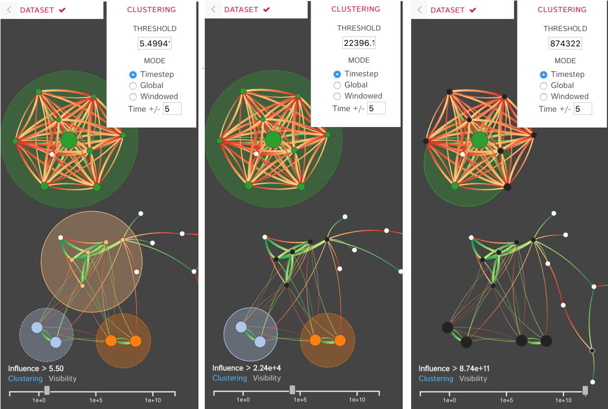
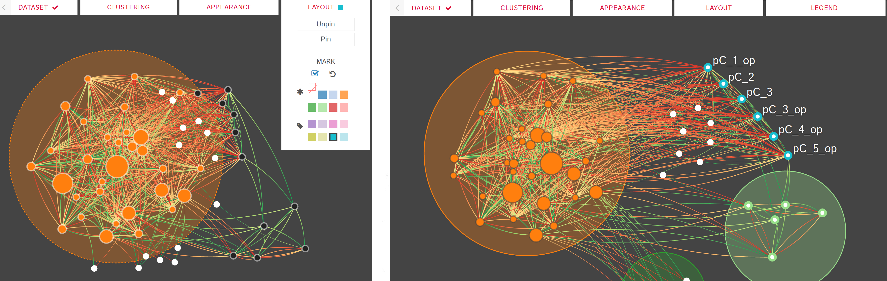
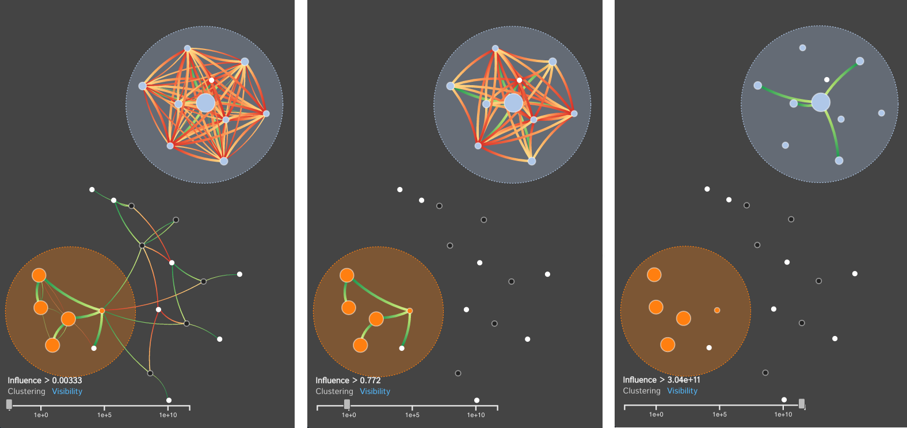
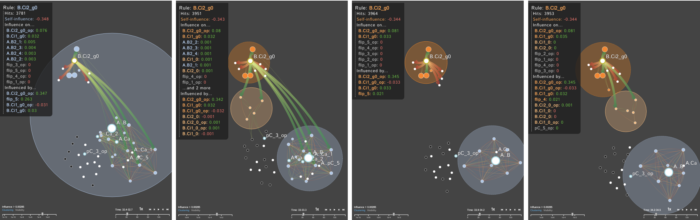

# Dynamic Influence Networks for Rule-based Models


DIN Project members: 

Angus Forbes, Andrew Burks, Kristine Lee, and Xing Li (University of Illinois at Chicago); Jean Krivine (Universite Paris Diderot); Pierre Boutillier and Walter Fontana (Harvard Medical School)

DIN-Viz Software Development: 

Andrew Burks, Kristine Lee, Xing Li (University of Illinois at Chicago)


# Installation Instructions

- Extract the Github repo's contents to a folder of your choice. 
- Navigate to the folder (which should now contain an "index.html" file) and use the command:
```[path to python.exe]\python -m SimpleHTTPServer 8080``` to start the server. If this command cannot start the server, use the command: ```[path to python.exe]\python -m http.server 8080``` instead. 
- Go to localhost:8080 to load the visualization. The software was tested on Google Chrome, but should work on other browsers as well.

Alternatively, the page is hosted using GitHub Pages at https://creativecodinglab.github.io/DynamicInfluenceNetworks/. (Use the "Dataset" menu to load in data/miniKaiProb3.zip to explore a larger example dataset, or choose your own KaSim output - see below.)

# How to Use

To load data, please click on the "Dataset" menu on the toolbar to load in individual json files or zipped time series json files. Alternatively, you can drag the files into the application to load the data. 

_Please make sure that the times series json files are in the format name_\__\[0-x]\.json (i.e flux_1.json, flux_2.json etc)_

# Background 

For many systems, the specifics regarding the interactions and effects within complex biological systems are unknown. The Kappa Simulator ([KaSim](http://www.kappalanguage.org)) is a stochastic simulator of biological "rules" defined using the Kappa language, used to generate simulations of protein-protein interaction networks. A tool to represent the outputs of these simulations can help systems biologists to better understand the complex systems that they are modeling. This creates a feedback loop between the creation and the visualization of the simulations which iteratively improves both the system models as well as the visual analytics tools which aid in representing and analyzing the biological systems. The current tools do not scale well, are static, cluttered, and can not support time-series visualization. We define the Dynamic Influence Network (DIN) to represent the rules and the influence these rules have on other rules that model the system. Our software tool, DIN-Viz, facilitates the analysis of DINs created from KaSim simulation output.

# The DIN-Viz Visual Analytics Software

DIN-Viz utilizes a force-directed network overlaid on top of influence-based clustering information for the Kappa rules (these influences are generated using Kappa Simulator output data). Due to relatively small number of nodes in these protein-protein interaction simulations, along with our threshold clustering method, the threshold is interactively controllable, and the clustering can recompute in real-time. To reduce clutter, the user may choose to manually rearrange areas of the network, as well as hide nodes or edges which fall below the clustering threshold. Individual nodes can also be manually marked and clustered. Time series data based on a sliding time window can be viewed (assuming the proper JSON data files have been loaded). Supplemental visualizations show overviews of the time series data, such as the influence that a selected rule has over other rules in the DIN throughout the simulation.

# Screenshots

- Clustering

    

- Hovering

    


- Pinning and Marking

    


- Link Visibility

    


- Dynamic Network Animation

    


# Demonstration Video

See a video of DIN-Viz in action [here](https://vimeo.com/195336381), or another newer one [here](https://dl.dropboxusercontent.com/u/571874/DIN-Viz_03312007_hd.mp4).


# Article

Our article, [Rule-based Models for Dynamic Influence Networks](https://creativecoding.soe.ucsc.edu/pdfs/Forbes_DIN-Viz_VAST2017.pdf), describing the DIN representation and the DIN-Viz software is accepted to [IEEE Transactions on Visualization and Computer Graphics](https://creativecoding.soe.ucsc.edu/pdfs/Forbes_DIN-Viz_VAST2017.pdf) and will be presented at [IEEE VIS](http://ieeevis.org/) in October 2017.


A. G. Forbes, A. Burks, K. Lee, X. Li, P. Boutillier, J. Krivine, and W. Fontana. Dynamic influence networks for rule-based models. IEEE Transactions on Visualization and Computer Graphics, 24(1), January 2018.


@article{
<br>&nbsp;&nbsp;&nbsp;&nbsp;ForbesFontana_TVCG_2018, 
<br>&nbsp;&nbsp;&nbsp;&nbsp;title = {Dynamic Influence Networks for Rule-based Models}, 
<br>&nbsp;&nbsp;&nbsp;&nbsp;author = {Angus G. Forbes and Andrew Burks and Kristine Lee and Xing Li and Pierre Boutillier and Jean Krivine and Walter Fontana}, 
<br>&nbsp;&nbsp;&nbsp;&nbsp;journal = {IEEE Transactions on Visualization and Computer Graphics}, 
<br>&nbsp;&nbsp;&nbsp;&nbsp;volume = {24}, 
<br>&nbsp;&nbsp;&nbsp;&nbsp;number = {1}, 
<br>&nbsp;&nbsp;&nbsp;&nbsp;month = {January}, 
<br>&nbsp;&nbsp;&nbsp;&nbsp;year = {2018} 
<br>}
